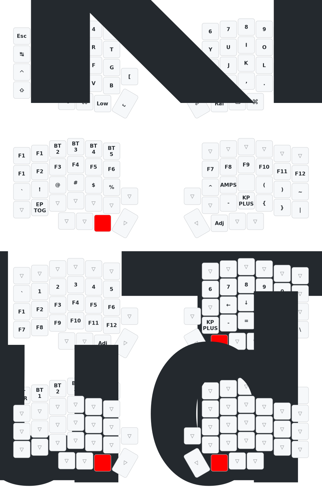

# MC Technology's zmk-config for lily58

[](https://www.youtube.com/channel/UC_mYh5PYPHBJ5YYUj8AIkcw)

<div align="center">

  [][youtube]
  [][facebook]
  [][reddit]

</div>
<br>

- [INTRO](#INTRO)
- [QUICK START](#QUICK-START)
- [LOCAL INSTALLATION](#LOCAL-INSTALLATION)
- [DISPLAY](#DISPLAY)
- [RGB](#RGB)
- [DONGLE](#DONGLE)
- [USEFUL TIPS](#USEFUL-TIPS)
- [ZMK STUDIO](#ZMK-STUDIO)
- [MODULE INTEGRATION](#MODULE-INTEGRATION)
- [THIS REPOSITORY AS A MODULE](#THIS-REPOSITORY-AS-A-MODULE)
- [INSPIRATIONS](#INSPIRATIONS)
- [MY OTHER PROJECTS](#MY-OTHER-PROJECTS)
- [RELATED PROJECTS](#RELATED-PROJECTS)
- [DONGLE DESIGNS](#DONGLE-DESIGNS)

----

- If you already have your lily58 configured with this repository and want to make
a modification to your keymap, you can do it with the online [ZMK-STUDIO](https://zmk.studio/).

- If you already have your lily58 configured with this repository and want to make
a modification to your keymap, you can do it with the online [keymap-editor](https://nickcoutsos.github.io/keymap-editor/).

- If you already have a repository and you want only the dongle option of this repository with support for `zmk-studio`, just add this repository as a module to your configuration, look the section [THIS REPOSITORY AS A MODULE](#THIS-REPOSITORY-AS-A-MODULE).

# INTRO

> [!CAUTION]
>
> I AM NOT RESPONSIBLE FOR ANY DAMAGE THIS CODE MAY CAUSE, USE IT AT YOUR OWN
> RISK.

> [!NOTE]
>
> FEEL FREE TO MODIFY THE CODE TO YOUR LIKING OR USE WHATEVER YOU NEED. I
> DECIDED TO REVOKE MANY CHANGES AND RETURN TO THE BASE MAPPING, SO THAT
> ADVANCED AND NON-ADVANCED  USERS CAN USE THIS REPOSITORY AS A BASE FOR THEIR
> CONFIGURATIONS. IF YOU HAVE ANY QUESTIONS, DON'T HESITATE TO ASK. IF YOU HAVE
> ANY SUGGESTIONS, FEEL FREE TO SUGGEST.

The objective of this repository is to serve as a base for configuring your
lily58 keyboard with the firmware [ZMK firmware] in a simple and fast way
without having to configure everything from scratch. Many of us are fascinated
by customizing our keyboards, but sometimes we don't have the time or
experience to do it. That is why I have decided to create this repository so
that you can have a base configuration and you can modify it to your liking.

This base includes configurations for lily58, featuring a setup for
the lily58 dongle with/without an OLED screen.

Tested with **[puchi_ble_v1]**, **[nice_nano_v2]**,
**clones of nice_nano_v2**, and the **[seeeduino_xiao_ble]**.

| Main Pros                                                                                       |
|-------------------------------------------------------------------------------------------------|
| mobility and flexibility                                                                        |
| reduction of tension and fatigue (ergonomic and ortholinear)                                    |
| improved productivity                                                                           |
| bluetooth and usb-c connection                                                                  |
| Highly customizable programmable with [ZMK firmware].                                           |
| compatibility with linux, windows, macos, android, ios and more                                 |
| completely wireless between the two halves and with the PC                                      |
| ultra-low consumption. extends battery life to the limit                                        |
| drag and drop thanks to the included uf2 bootloader                                             |
| no additional software required for flashing                                                    |
| support for multiple devices (up to 5)                                                          |
| mouse keys                                                                                      |
| rgb                                                                                             |
| macros                                                                                          |
| tap dance                                                                                       |
| combos                                                                                          |
| up to 1 week of use without charger (with 100mah)                                               |
| support [nice-view] screen and oled screen                                                      |
| online editor for keymap. see [keymap-editor]                                     |
| 100% open source                                                                                |
| support for puchi-ble dongle, nice!nano v2, nice!nano v2 clones, seeeduino xiao ble and more... |
| support with dongle with display 128x32, 128x64 and 128x128                                     |
| and more...                                                                                     |

# QUICK START
> [!NOTE]
>
> 1. With this configuration you can use the lily58 keyboard practically
> immediately, you just have to follow the following steps and that's it.
>
> 2. If you need precompiled files you can download them from the [firmware
>    folder](./firmware)
>
> 3. If you have any problems, you just have to flash the reset firmwares that
>    are in the [firmware](./firmware) folder and that's it.

### zmk-studio (quick start)
This repository includes the necessary configuration to use zmk-studio without
the need to configure anything else. You just have to follow the steps below:
- Fork this repository and flash the firmware to the keyboard with the uf2 files
- Connect the master (dongle or central) to the PC
- Modify the keyboard mapping on the go with [ZMK Studio Web](https://zmk.studio/)

### normal procedure
1. Fork this repository (I appreciate if you follow me on [github] and [youtube])
2. Modify the keyboard mapping with [keymap-editor]
3. Save changes and commit (optional)
4. Go to actions on github and download the artifacts
   - Actions(click) -> All Workflows (click)-> Initial User Config. (here you
     scroll to the bottom and click)
   - Here is something called artifacts, click to download the file, it is a .zip
   - Unzip the .zip file
   - Connect the nice!nano v2 microcontroller to the USB-C port of your computer
   - The microcontroller is recognized as a storage device
5. Flash the firmware to the keyboard with the uf2 files:
   - `nice_lily58_left.uf2` for left half
   - `nice_lily58_right.uf2` for right half
6. If you need help, you can ask in the [ZMK Discord]
7. Enjoy your new keyboard

## keymap lily58
[](https://www.youtube.com/c/mctechnology17)

# LOCAL INSTALLATION
1. Clone _your fork_ of this repository:
   ```bash
   git clone https://github.com/mctechnology17/zmk-config.git
   cd zmk-config
   ```

2. To compile with make, run:
   ```bash
   make codebase_urob
   make lily58_urob
   ```

# DISPLAY
1. ePAPER ([nice-view])
2. OLED (SSD1306 / sh1107 / sh1106)
3. FULL COLOR LCD SCREEN ([Prospector](https://github.com/carrefinho/prospector))

> [!IMPORTANT]
>
> To modify the dongle's OLED screen you can modify the `.overlay` files for your specific board.

# RGB
> [!WARNING]
>
> If you use [nice-view] you cannot use rgb, since [nice-view] uses the same
> pinout as rgb.

# DONGLE
You can connect a display to the dongle. See connection diagrams for:
- [seeeduino_xiao_ble](./src/pinout-seeeduino_xiao_ble.png)
- [pro_micro](./src/pinout-pro_micro.png)

Combo example to enter bootloader mode:
```c
COMBO(combo_bootloader, &bootloader, 0 1 2, 0)
```

# USEFUL TIPS
- Add reset keys on each half
- Add bootloader activators
- If halves desynchronize, press reset buttons 10 times
- To reflash: connect half, press reset button twice, drag firmware file
- Combine different boards (left nice_nano_v2, right puchi_ble_v1, etc.)

# ZMK STUDIO
- Enable `&studio_unlock` macro or `CONFIG_ZMK_STUDIO_LOCKING=n`
- Activate on master and dongle: `snippet: studio-rpc-usb-uart`
- USB connection for web, BLE for app

# MODULE INTEGRATION
Useful modules:
- [nice_view_gem](https://github.com/M165437/nice-view-gem)
- [nice_oled](https://github.com/mctechnology17/zmk-nice-oled)
- [zmk-dongle-display](https://github.com/englmaxi/zmk-dongle-display)
- [dongle_display!view](https://github.com/mctechnology17/zmk-dongle-display-view)
- [oled Adapter](https://github.com/mctechnology17/zmk-oled-adapter)

# THIS REPOSITORY AS A MODULE
1. In `config/west.yml` add:
```yaml
remotes:
  - name: mctechnology17
    url-base: https://github.com/mctechnology17
projects:
  - name: zmk-config
    remote: mctechnology17
    revision: main
```

2. In `build.yaml` add lily58 shields

3. Build and flash firmware

# INSPIRATIONS
- [englmaxi/zmk-config](https://github.com/englmaxi/zmk-config)
- [caksoylar/zmk-config](https://github.com/caksoylar/zmk-config)
- [joelspadin/zmk-locale-generator](https://github.com/joelspadin/zmk-locale-generator)
- [minusfive/zmk-config](https://github.com/minusfive/zmk-config)
- [infused-kim/zmk-config](https://github.com/infused-kim/zmk-config)
- [urob/zmk-config](https://github.com/urob/zmk-config)

# RELATED PROJECTS
- [zmk-dongle-display](https://github.com/englmaxi/zmk-dongle-display.git)
- [zmk-config for module](https://github.com/englmaxi/zmk-config)

# DONGLE DESIGNS
- [case1](https://github.com/englmaxi/zmk-dongle-display/raw/main/cases/case1.zip)
- [case2](https://github.com/englmaxi/zmk-dongle-display/raw/main/cases/case2.zip)
- [Dongle PCB](https://github.com/spe2/zmk_dongle_hardware)
- [Macintosh](https://makerworld.com/en/models/403660)
- [ZMK Display Dongle](https://makerworld.com/en/models/496738)

# TODO
- [ ] Add more features to the repository
- [ ] Update the documentation

[github]: https://github.com/mctechnology17
[youtube]: https://www.youtube.com/c/mctechnology17
[facebook]: https://m.facebook.com/mctechnology17/
[reddit]: https://www.reddit.com/user/mctechnology17
[nice-view]: https://nicekeyboards.com/nice-view
[puchi_ble_v1]: https://keycapsss.com/keyboard-parts/mcu-controller/202/puchi-ble-wireless-microcontroller-pro-micro-replacement
[seeeduino_xiao_ble]: https://keycapsss.com/keyboard-parts/mcu-controller/212/seeed-studio-xiao-nrf52840-rp2040-esp32c3
[nice_nano_v2]: https://nicekeyboards.com/nice-nano
[keymap-editor]: https://nickcoutsos.github.io/keymap-editor/
[ZMK firmware]: https://github.com/zmkfirmware/zmk/
[ZMK Discord]: https://zmk.dev/community/discord/invite
